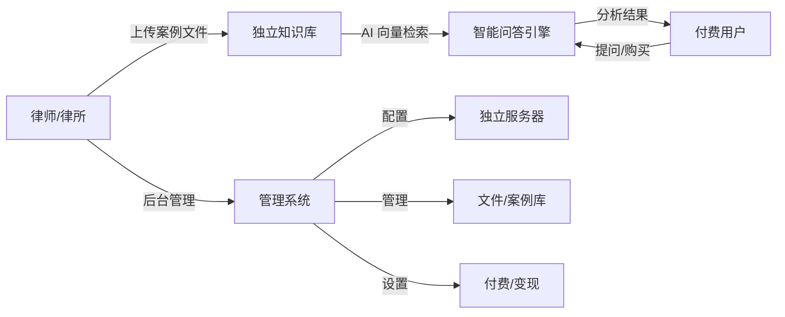
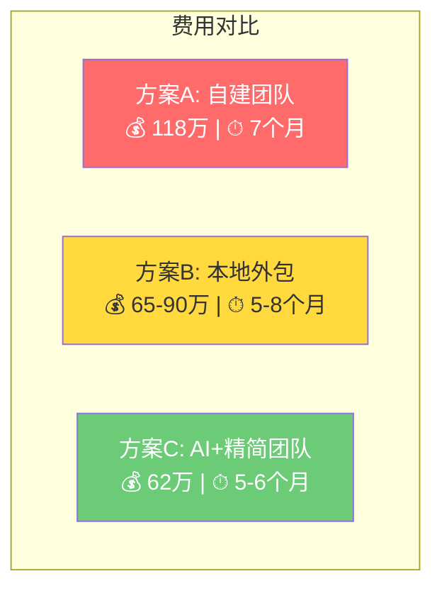

# 🏛️ 律师行业 AI 知识库系统 — 开发成本评估报告

> **评估基准：** 广州 2026 年 IT 行业工资水平  
> **评估日期：** 2026-05-21  
> **系统类型：** SaaS 多租户知识库 + AI 问答 + 内容变现平台

---

## 一、需求全景分析

### 核心业务场景

### 功能模块拆解

| 模块 | 子功能 | 复杂度 | 优先级 |
|------|--------|--------|--------|
| **① 用户系统** | 注册/登录、角色权限（管理员/律师/普通用户）、OAuth 集成 | ⭐⭐ | P0 |
| **② 服务器配置** | 律师自主配置独立服务器地址、连接测试、密钥管理、多节点管理 | ⭐⭐⭐⭐ | P0 |
| **③ 文件管理** | 案例文件上传（PDF/Word/图片OCR）、分类标签、版本管理、批量操作 | ⭐⭐⭐ | P0 |
| **④ AI 知识库引擎** | 文档解析→向量化→存储、语义检索、RAG 问答、多轮对话 | ⭐⭐⭐⭐⭐ | P0 |
| **⑤ 案例分析** | 案例智能摘要、关键信息提取、相似案例匹配、法律条文关联 | ⭐⭐⭐⭐ | P1 |
| **⑥ 付费变现** | 知识库定价、订阅/单次购买、支付集成（微信/支付宝）、分成结算 | ⭐⭐⭐⭐ | P1 |
| **⑦ 后台管理** | 数据统计、用户管理、内容审核、系统监控、操作日志 | ⭐⭐⭐ | P0 |
| **⑧ 前端展示** | 知识库主页、搜索界面、问答交互、个人中心、移动端适配 | ⭐⭐⭐ | P0 |

---

## 二、技术架构方案

### 推荐技术栈

| 层级 | 技术选型 | 说明 |
|------|---------|------|
| **前端** | React/Next.js + TypeScript | SSR + 良好 SEO，生态成熟 |
| **后端** | Python (FastAPI) 或 Node.js (NestJS) | FastAPI 适合 AI 场景，NestJS 适合复杂业务 |
| **数据库** | PostgreSQL + Redis | 主库 + 缓存 |
| **向量数据库** | Milvus / Qdrant / Weaviate | 存储文档向量，支持语义检索 |
| **AI/LLM** | OpenAI API / 通义千问 / DeepSeek | RAG 检索增强生成 |
| **文件存储** | 阿里云 OSS / MinIO | 案例文件存储 |
| **消息队列** | RabbitMQ / Redis Queue | 异步文档处理 |
| **容器化** | Docker + K8s | 多租户隔离部署 |
| **支付** | 微信支付 + 支付宝 SDK | 国内主流支付渠道 |

### 架构难点

> [!WARNING]
> **"每个律师独立服务器"** 是本项目最大的架构挑战。有两种实现路径：

| 方案 | 描述 | 优点 | 缺点 |
|------|------|------|------|
| **A. 真·独立部署** | 每个律师/律所一套独立服务器实例 | 数据完全隔离，安全性最高 | 运维成本极高，开发需做自动化部署 |
| **B. 多租户隔离** | 共享基础设施，逻辑隔离数据 | 成本可控，易于维护 | 需要严格的数据隔离策略 |
| **C. 混合方案（推荐）** | 平台统一管理，知识库引擎可连接律师自有服务器 | 平衡成本与灵活性 | 需要设计灵活的连接器 |

---

## 三、团队配置与广州薪资基准

### 广州 IT 行业 2026 年月薪参考

| 岗位 | 级别 | 月薪范围（税前） | 本项目取值 | 含社保公积金企业成本 |
|------|------|-----------------|-----------|-------------------|
| 项目经理 | 中高级 | 20K-30K | **25K** | **35K** |
| 前端工程师 | 中高级 | 18K-28K | **22K** | **31K** |
| 后端工程师 | 高级 | 22K-35K | **28K** | **39K** |
| AI/算法工程师 | 高级 | 25K-40K | **32K** | **45K** |
| UI/UX 设计师 | 中级 | 15K-22K | **18K** | **25K** |
| 测试工程师 | 中级 | 14K-20K | **16K** | **22K** |
| DevOps 工程师 | 中级 | 18K-28K | **22K** | **31K** |

> [!NOTE]
> 企业实际用人成本 ≈ 税前工资 × 1.4（含五险一金企业部分、办公成本、管理成本等）

---

## 四、开发工时估算

### MVP（最小可行产品）— 第一阶段

| 模块 | 前端(人天) | 后端(人天) | AI(人天) | 设计(人天) | 测试(人天) |
|------|-----------|-----------|---------|-----------|-----------|
| 用户系统（注册/登录/权限） | 8 | 10 | - | 5 | 5 |
| 服务器配置管理 | 10 | 20 | - | 5 | 8 |
| 文件管理系统 | 12 | 15 | - | 5 | 6 |
| AI 知识库引擎（RAG） | 8 | 15 | **30** | 3 | 10 |
| 智能问答界面 | 15 | 10 | **15** | 8 | 8 |
| 后台管理 Dashboard | 15 | 12 | - | 8 | 6 |
| 基础架构搭建 | 5 | 15 | 5 | - | - |
| 联调 & 集成测试 | 5 | 5 | 3 | - | 10 |
| **小计** | **78** | **102** | **53** | **34** | **53** |

### 完整版 — 第二阶段

| 模块 | 前端(人天) | 后端(人天) | AI(人天) | 设计(人天) | 测试(人天) |
|------|-----------|-----------|---------|-----------|-----------|
| 付费变现系统 | 15 | 25 | - | 8 | 10 |
| 案例深度分析 | 10 | 10 | **20** | 5 | 8 |
| 数据统计 & 报表 | 12 | 15 | - | 5 | 5 |
| 移动端适配/小程序 | 20 | 10 | - | 10 | 8 |
| 多租户部署自动化 | - | 15 | - | - | 5 |
| 安全加固 & 合规 | 3 | 10 | - | - | 5 |
| **小计** | **60** | **85** | **20** | **28** | **41** |

---

## 五、开发周期与费用估算

### 方案 A：自建团队开发

#### MVP 阶段（约 3.5-4 个月）

| 角色 | 人数 | 投入月数 | 月成本 | 小计 |
|------|------|---------|--------|------|
| 项目经理 | 1 | 4 | 35K | **14万** |
| 前端工程师 | 1 | 4 | 31K | **12.4万** |
| 后端工程师 | 1 | 4 | 39K | **15.6万** |
| AI 工程师 | 1 | 3 | 45K | **13.5万** |
| UI 设计师 | 1 | 2 | 25K | **5万** |
| 测试工程师 | 1 | 2.5 | 22K | **5.5万** |
| **人力小计** | | | | **66万** |
| 云服务器（开发环境） | - | 4 | 3K | **1.2万** |
| AI API 调用费 | - | 4 | 2K | **0.8万** |
| 第三方服务/工具 | - | - | - | **1万** |
| **MVP 总计** | | | | **≈ 69万** |

#### 完整版（再追加 2.5-3 个月）

| 角色 | 人数 | 投入月数 | 月成本 | 小计 |
|------|------|---------|--------|------|
| 项目经理 | 1 | 3 | 35K | **10.5万** |
| 前端工程师 | 1 | 3 | 31K | **9.3万** |
| 后端工程师 | 1 | 3 | 39K | **11.7万** |
| AI 工程师 | 1 | 1.5 | 45K | **6.75万** |
| UI 设计师 | 1 | 1.5 | 25K | **3.75万** |
| 测试工程师 | 1 | 2 | 22K | **4.4万** |
| **追加小计** | | | | **≈ 46.4万** |
| 额外云服务 & API | | | | **3万** |

> [!IMPORTANT]
> ### 💰 自建团队总成本
> 
> | 阶段 | 周期 | 费用 |
> |------|------|------|
> | MVP 版本 | 3.5-4 个月 | **≈ 69 万** |
> | 完整版本 | 累计 6.5-7 个月 | **≈ 118 万** |
> | 后续维护（年） | 持续 | **≈ 30-50 万/年** |

---

### 方案 B：外包开发

| 外包类型 | MVP 费用 | 完整版费用 | 周期 | 质量风险 |
|---------|---------|-----------|------|---------|
| 广州本地中型外包公司 | 35-50万 | 65-90万 | 5-8个月 | ⭐⭐⭐ 中等 |
| 一线外包公司（广深） | 50-80万 | 90-150万 | 4-7个月 | ⭐⭐⭐⭐ 较好 |
| 远程/小团队外包 | 20-35万 | 40-65万 | 6-10个月 | ⭐⭐ 较高风险 |
| 越南/印度离岸外包 | 15-25万 | 30-50万 | 6-12个月 | ⭐⭐ 沟通成本高 |

> [!TIP]
> **推荐：** 广州本地中型外包公司，预算 **65-90万** 做完整版，签分阶段验收合同。

---

### 方案 C：AI 辅助 + 精简团队（推荐 🔥）

借助 AI 编码工具（Cursor/Copilot）大幅提效，减少人力需求：

| 角色 | 人数 | 投入月数 | 月成本 | 小计 |
|------|------|---------|--------|------|
| 全栈技术负责人（懂 AI） | 1 | 6 | 42K | **25.2万** |
| 全栈工程师 | 1 | 6 | 35K | **21万** |
| UI/前端 | 1 | 3 | 28K | **8.4万** |
| 测试（兼职/外包） | 1 | 2 | 18K | **3.6万** |
| AI 工具订阅 | - | 6 | 2K | **1.2万** |
| 云服务 + API | - | 6 | 5K | **3万** |
| **总计** | | | | **≈ 62.4万** |

> 周期：5-6 个月完成完整版

---

## 六、各方案成本对比总览

| 维度 | 方案 A（自建） | 方案 B（外包） | 方案 C（AI+精简）|
|------|--------------|--------------|-----------------|
| **总费用** | ~118万 | 65-90万 | ~62万 |
| **开发周期** | 6.5-7个月 | 5-8个月 | 5-6个月 |
| **代码质量** | ⭐⭐⭐⭐⭐ | ⭐⭐⭐ | ⭐⭐⭐⭐ |
| **后续维护** | 方便（自有团队） | 困难（需续约） | 较方便 |
| **扩展性** | 最强 | 取决于合同 | 较强 |
| **风险** | 招聘风险 | 交付风险 | 人员依赖风险 |

---

## 七、运营成本（上线后每月）

> [!IMPORTANT]
> 除了开发成本，别忘了持续运营支出：

| 项目 | 月费用 | 备注 |
|------|--------|------|
| 云服务器（平台侧） | 3,000-8,000 | 阿里云/腾讯云，视用户量 |
| AI API 调用（LLM + Embedding） | 2,000-15,000 | 取决于问答量，可用国产模型降本 |
| 向量数据库服务 | 1,000-3,000 | Milvus Cloud 或自建 |
| CDN + 带宽 | 500-2,000 | 文件下载加速 |
| SSL 证书 + 域名 | 100 | 基础费用 |
| 短信/邮件服务 | 200-500 | 验证码等 |
| 支付手续费 | 按流水 0.6% | 微信/支付宝 |
| 运维人员（兼职） | 5,000-10,000 | 日常维护 |
| **月运营总计** | **1.2万-4万** | 视规模而定 |

---

## 八、关键风险与建议

### ⚠️ 风险提示

| 风险 | 等级 | 应对策略 |
|------|------|---------|
| AI 问答准确性不达预期 | 🔴 高 | 预留 Prompt 工程调优时间，建立人工审核机制 |
| 律师数据隐私合规（个人信息保护法） | 🔴 高 | 聘请法律顾问审查，做数据加密和审计日志 |
| "独立服务器"需求导致运维复杂度飙升 | 🟡 中 | 推荐多租户方案，仅对大客户提供独立部署 |
| 支付资质审批周期长 | 🟡 中 | 提前 2 个月申请微信/支付宝商户号 |
| AI API 成本不可控 | 🟡 中 | 使用国产模型（DeepSeek/通义千问）+ 缓存策略 |

### ✅ 实施建议

1. **分阶段交付**：先做 MVP（核心知识库 + AI 问答 + 基础管理），验证市场后再加付费功能
2. **技术选型偏国产**：DeepSeek / 通义千问 API 成本远低于 OpenAI，且合规无障碍
3. **"独立服务器"简化为"独立数据空间"**：大幅降低运维成本，99% 用户感知无差异
4. **法律合规先行**：律师行业数据敏感，务必做好数据加密、操作审计、隐私合规
5. **预留 AI 调优预算**：知识库问答效果需要持续优化，建议预留 15% 预算用于上线后调优

---

## 九、结论

> [!IMPORTANT]
> ### 📊 最终建议
> 
> **推荐方案 C（AI 辅助 + 精简团队），预算区间 55-70 万，周期 5-6 个月。**
> 
> 如果有可靠的本地外包资源，方案 B 也是不错的选择，预算控制在 **70-90 万**。
> 
> **无论哪种方案，请额外预留：**
> - 法律合规审查费：3-5 万
> - 上线后 AI 调优：5-8 万
> - 首年运营费：15-48 万
> 
> **首年总投入（开发 + 运营）合理预算：80-130 万**

---

*本报告基于广州 2026 年 IT 行业薪资水平估算，实际费用受需求变更、技术难度、人员经验等因素影响，建议以此作为预算参考基准。*
