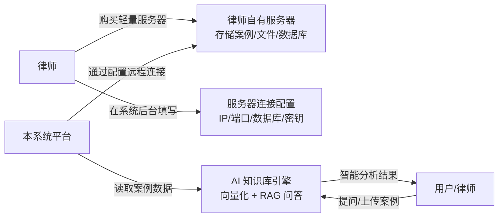
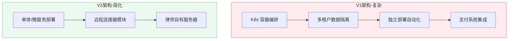

# 🏛️ 律师行业 AI 知识库系统 — 开发成本评估 V2（修订版）

> **评估基准：** 广州 2026 年 IT 行业工资水平  
> **评估日期：** 2026-05-21  
> **修订说明：** 去掉付费变现模块；服务器为律师自购轻量云服务器，系统仅做远程连接调取

---

## 一、需求理解（修正后）

### 系统本质

这是一个**带远程数据源连接能力的 AI 知识库管理平台**，核心流程：

### 与 V1 的差异

| 项目 | V1（原评估） | V2（修订后） | 变化 |
|------|-------------|-------------|------|
| 付费变现模块 | 需开发（支付集成等） | ❌ 不开发 | **减少 ~58 人天** |
| 服务器架构 | 多租户/独立部署（复杂） | 远程连接器（简单） | **大幅简化** |
| 数据存储 | 平台侧存储+隔离 | 律师服务器存储，平台只调取 | **减少存储设计** |
| 部署自动化 | 需要 K8s 编排 | 不需要 | **减少 ~20 人天** |

---

## 二、修订后功能模块

| 模块 | 子功能 | 复杂度 | 说明 |
|------|--------|--------|------|
| **① 用户系统** | 注册/登录、角色权限（管理员/律师/普通用户） | ⭐⭐ | 标准模块 |
| **② 服务器连接配置** | 填写服务器 IP/端口/数据库连接信息、连接测试、加密存储凭证 | ⭐⭐⭐ | 核心模块，需保证安全 |
| **③ 远程文件管理** | 远程浏览/上传/下载案例文件、分类标签、支持 PDF/Word/图片 | ⭐⭐⭐ | 通过连接器操作远程服务器 |
| **④ AI 知识库引擎** | 远程文档拉取→解析→向量化→语义检索→RAG 问答 | ⭐⭐⭐⭐⭐ | 核心价值，复杂度最高 |
| **⑤ 案例分析** | 案例智能摘要、关键信息提取、相似案例匹配 | ⭐⭐⭐⭐ | 依赖 AI 引擎 |
| **⑥ 后台管理** | 数据统计、用户管理、操作日志、系统监控 | ⭐⭐⭐ | 标准后台 |
| **⑦ 前端展示** | 知识库界面、搜索、问答交互、个人中心 | ⭐⭐⭐ | 标准前端 |

> [!NOTE]
> 去掉了：付费变现、多租户架构、容器编排、支付集成、分成结算

---

## 三、修订后技术架构

| 层级 | 技术选型 | 说明 |
|------|---------|------|
| **前端** | React/Next.js + TypeScript | 管理后台 + 问答界面 |
| **后端** | Python (FastAPI) | 轻量高效，AI 生态好 |
| **平台数据库** | PostgreSQL + Redis | 用户/配置信息 |
| **远程连接** | SSH/SFTP + 数据库驱动（MySQL/PostgreSQL） | 连接律师自有服务器 |
| **向量数据库** | Qdrant（轻量部署）或 ChromaDB | 语义检索 |
| **AI/LLM** | DeepSeek / 通义千问 API | 低成本国产模型 |
| **文档解析** | LangChain + Unstructured | PDF/Word/OCR 解析 |

### 架构简化对比

---

## 四、修订后工时估算

### MVP（最小可行产品）

| 模块 | 前端(人天) | 后端(人天) | AI(人天) | 设计(人天) | 测试(人天) | 合计 |
|------|-----------|-----------|---------|-----------|-----------|------|
| 用户系统（注册/登录/权限） | 6 | 8 | - | 4 | 4 | **22** |
| 服务器连接配置 | 8 | 12 | - | 4 | 5 | **29** |
| 远程文件管理 | 10 | 12 | - | 4 | 5 | **31** |
| AI 知识库引擎（RAG） | 6 | 12 | **25** | 2 | 8 | **53** |
| 智能问答界面 | 12 | 8 | **12** | 6 | 6 | **44** |
| 后台管理 Dashboard | 12 | 10 | - | 6 | 4 | **32** |
| 基础架构搭建 | 3 | 8 | 3 | - | - | **14** |
| 联调 & 集成测试 | 4 | 4 | 2 | - | 8 | **18** |
| **小计** | **61** | **74** | **42** | **26** | **40** | **243** |

### 完善版（追加功能）

| 模块 | 前端(人天) | 后端(人天) | AI(人天) | 设计(人天) | 测试(人天) | 合计 |
|------|-----------|-----------|---------|-----------|-----------|------|
| 案例深度分析（摘要/关联） | 8 | 8 | **15** | 4 | 6 | **41** |
| 数据统计 & 报表 | 10 | 10 | - | 4 | 4 | **28** |
| 移动端适配 | 10 | 3 | - | 5 | 4 | **22** |
| 安全加固（连接加密/审计日志） | 2 | 8 | - | - | 4 | **14** |
| **小计** | **30** | **29** | **15** | **13** | **18** | **105** |

> **总工时：243 + 105 = 348 人天**（V1 原估算约 520+ 人天，减少约 33%）

---

## 五、修订后费用估算

### 方案 A：自建团队

#### MVP 阶段（约 2.5-3 个月）

| 角色 | 人数 | 投入月数 | 月成本（含企业负担） | 小计 |
|------|------|---------|-------------------|------|
| 项目经理（可兼后端） | 1 | 3 | 35K | **10.5万** |
| 前端工程师 | 1 | 3 | 31K | **9.3万** |
| 后端工程师 | 1 | 3 | 39K | **11.7万** |
| AI 工程师 | 1 | 2.5 | 45K | **11.25万** |
| UI 设计师 | 1 | 1.5 | 25K | **3.75万** |
| 测试工程师 | 1 | 2 | 22K | **4.4万** |
| **人力小计** | | | | **50.9万** |
| 云服务器（开发环境） | - | 3 | 2K | **0.6万** |
| AI API 调用费 | - | 3 | 1.5K | **0.45万** |
| **MVP 总计** | | | | **≈ 52万** |

#### 完善版（再追加 1.5-2 个月）

| 角色 | 人数 | 投入月数 | 月成本 | 小计 |
|------|------|---------|--------|------|
| 项目经理 | 1 | 2 | 35K | **7万** |
| 前端工程师 | 1 | 1.5 | 31K | **4.65万** |
| 后端工程师 | 1 | 1.5 | 39K | **5.85万** |
| AI 工程师 | 1 | 1 | 45K | **4.5万** |
| 测试工程师 | 1 | 1 | 22K | **2.2万** |
| **追加人力** | | | | **24.2万** |
| 追加云服务 + API | | | | **1万** |

> [!IMPORTANT]
> ### 💰 方案 A 自建团队总成本
> 
> | 阶段 | 周期 | 费用 |
> |------|------|------|
> | MVP 版本 | 2.5-3 个月 | **≈ 52 万** |
> | 完整版本 | 累计 4.5-5 个月 | **≈ 77 万** |
> 
> **对比 V1：从 118 万降至 77 万，节省 35%**

---

### 方案 B：外包开发

| 外包类型 | MVP 费用 | 完整版费用 | 周期 |
|---------|---------|-----------|------|
| 广州本地中型外包 | 25-35万 | 45-60万 | 3.5-6个月 |
| 一线外包（广深） | 35-50万 | 60-85万 | 3-5个月 |
| 小团队/个人 | 12-20万 | 25-40万 | 4-8个月 |

---

### 方案 C：AI 辅助 + 精简团队（推荐 🔥）

| 角色 | 人数 | 投入月数 | 月成本 | 小计 |
|------|------|---------|--------|------|
| 全栈技术负责人（懂 AI + Python） | 1 | 4.5 | 42K | **18.9万** |
| 全栈工程师 | 1 | 4.5 | 35K | **15.75万** |
| UI/前端（兼职） | 1 | 2 | 25K | **5万** |
| 测试（兼职/外包） | 1 | 1.5 | 18K | **2.7万** |
| AI 工具订阅（Cursor 等） | - | 4.5 | 1.5K | **0.68万** |
| 云服务 + API | - | 4.5 | 3K | **1.35万** |
| **总计** | | | | **≈ 44.4万** |

> 周期：4-4.5 个月完成完整版

---

## 六、三方案对比总览

| 维度 | 方案 A（自建） | 方案 B（本地外包） | 方案 C（AI+精简）🔥 |
|------|--------------|------------------|-------------------|
| **完整版费用** | **~77万** | **45-60万** | **~44万** |
| **开发周期** | 4.5-5个月 | 3.5-6个月 | 4-4.5个月 |
| **代码质量** | ⭐⭐⭐⭐⭐ | ⭐⭐⭐ | ⭐⭐⭐⭐ |
| **后续维护** | 最方便 | 需续约 | 较方便 |
| **适合场景** | 长期产品化 | 预算充足求稳 | **性价比最优** |

---

## 七、运营成本（修订后·上线后每月）

> [!NOTE]
> 因为案例数据存在律师自己的服务器上，平台侧运营成本大幅降低：

| 项目 | 月费用 | 备注 |
|------|--------|------|
| 平台服务器（仅跑系统） | 1,500-3,000 | 不存储案例数据，压力小很多 |
| AI API 调用 | 1,500-8,000 | 取决于问答量 |
| 向量数据库 | 500-1,500 | 轻量部署即可 |
| 域名 + SSL | 100 | 基础 |
| 运维（兼职） | 3,000-5,000 | 日常维护 |
| **月运营总计** | **0.7万-1.8万** | 比 V1 降低约 50% |

> [!TIP]
> 律师自有服务器的费用（轻量云，约 50-200 元/月）由律师自己承担，不计入平台成本。

---

## 八、与 V1 对比汇总

| 对比项 | V1（原评估） | V2（修订后） | 降幅 |
|--------|-------------|-------------|------|
| 功能模块数 | 8 个 | 7 个 | -12.5% |
| 总工时 | ~520 人天 | ~348 人天 | **-33%** |
| 自建团队费用 | ~118 万 | ~77 万 | **-35%** |
| AI+精简团队 | ~62 万 | ~44 万 | **-29%** |
| 开发周期 | 6.5-7 个月 | 4-5 个月 | **-30%** |
| 月运营成本 | 1.2-4 万 | 0.7-1.8 万 | **-50%** |

---

## 九、结论

> [!IMPORTANT]
> ### 📊 修订后最终建议
> 
> | 推荐方案 | 费用 | 周期 |
> |---------|------|------|
> | **方案 C：AI + 精简团队** | **40-50 万** | **4-4.5 个月** |
> | 方案 B：本地外包（备选） | 45-60 万 | 3.5-6 个月 |
> 
> **需额外预留：**
> - 法律合规审查费：2-3 万（律师行业数据敏感）
> - AI 调优预算：3-5 万（上线后优化问答效果）
> - 首年运营费：8-22 万
> 
> ### 💡 首年总投入（开发 + 运营）合理预算：55-80 万

---

### 关键简化带来的收益

1. **去掉支付系统** → 减少 ~58 人天，省去支付资质申请的等待
2. **服务器连接器替代多租户** → 架构从"复杂分布式"降为"单体+远程连接"，大幅降低后端和 DevOps 成本
3. **数据存储在律师侧** → 平台不承担存储成本和数据合规主要责任
4. **无需容器编排** → 不需要 K8s，普通服务器部署即可

*本报告基于广州 2026 年 IT 行业薪资水平估算，实际费用受需求变更、技术难度、人员经验等因素影响。*
